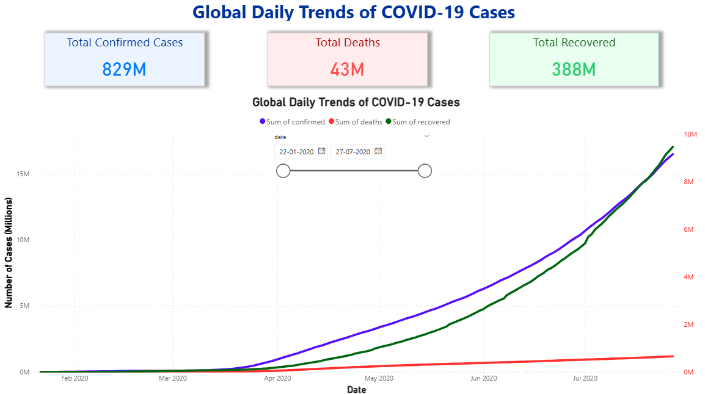
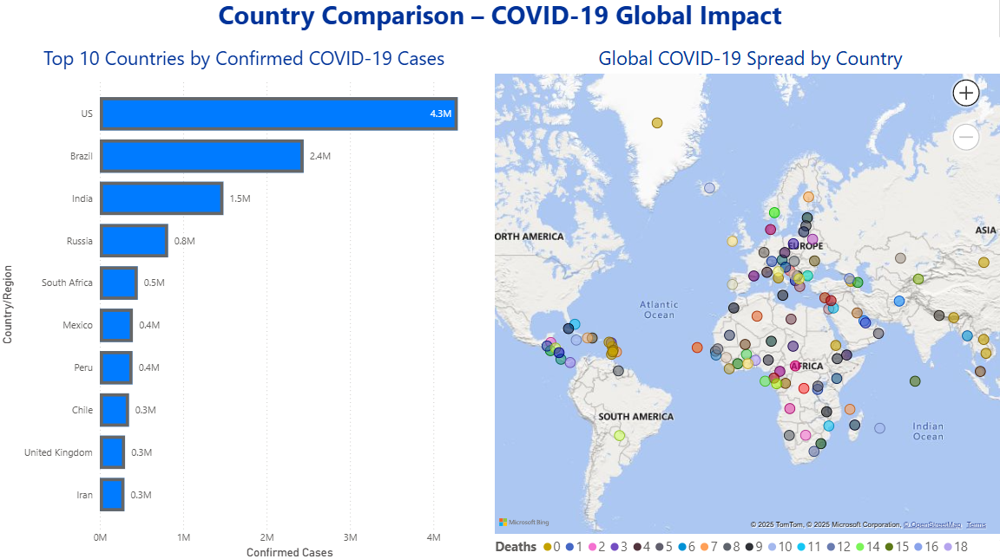
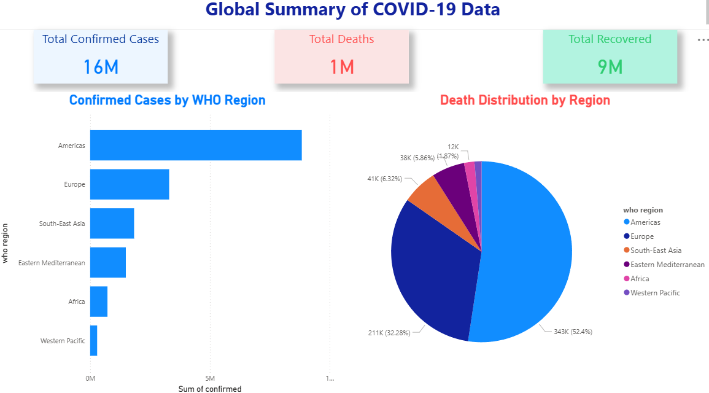

# 🌍 Global COVID-19 Data Analysis using Python and Power BI

### 📊 Overview
This project demonstrates an **end-to-end data analysis workflow** using real-world COVID-19 data.  
The goal is to clean, analyze, and visualize the datasets to uncover trends and insights on the global pandemic using **Python (Pandas)** and **Power BI**.

---

## 🧰 Tools & Technologies
- **Python** → Data cleaning and preprocessing  
- **Pandas, NumPy** → Data manipulation and metric creation  
- **Power BI** → Interactive dashboards and visualization  
- **Excel** → Quick data validation and review  

---

## 📂 Project Structure
Global-COVID19-Data-Analysis/
│
├── covid_data_cleaning.py # Python script for cleaning and preprocessing
├── Global_COVID19_Dashboard.pbix # Final Power BI dashboard
│
├── Health Related Datasets/
│ ├── Raw Datasets/ # Raw Kaggle datasets
│ │ ├── country_wise_latest.csv
│ │ ├── day_wise.csv
│ │ ├── worldometer_data.csv
│ │
│ └── Cleaned Datasets/ # Cleaned data generated using Python
│ ├── country_cleaned.csv
│ ├── day_cleaned.csv
│ ├── worldometer_cleaned.csv
│
├── images/ # Power BI dashboard screenshots
│ ├── daily_trends.png
│ ├── country_comparison.png
│ ├── global_summary.png
---

## ⚙️ Data Cleaning Workflow
Performed using **`covid_data_cleaning.py`** with Pandas:
1. Loaded raw Kaggle datasets  
2. Dropped missing or inconsistent values  
3. Renamed columns for uniformity  
4. Created two calculated columns:
   - `recovery_rate = (recovered / confirmed) * 100`
   - `death_rate = (deaths / confirmed) * 100`
5. Exported cleaned CSVs into the *Cleaned Datasets* folder  

---

## 📊 Power BI Dashboard Overview
The Power BI report (`Global_COVID19_Dashboard.pbix`) includes **three interactive pages**.

---

### 🩵 Page 1: Daily Trends
Visualizes the daily progression of **confirmed**, **deaths**, and **recovered** cases over time.

---

### 🩵 Page 2: Country Comparison
Shows **Top 10 countries** with the highest confirmed cases, along with a **world map** for geographic visualization.

---

### 🩵 Page 3: Global Summary
Highlights overall statistics such as total confirmed, deaths, recovered, and global recovery/death rates using KPI cards and charts.

---

## 💡 Key Insights
- The USA and Brazil reported the highest confirmed cases globally.  
- Global average recovery rate ≈ **47%**.  
- Death rates steadily declined post-2021 due to improved healthcare and vaccinations.  
- Power BI dashboards reveal clear global and regional pandemic patterns.  

---

## 🧑‍💻 Author
**Sri Ram**  
_Data Analyst | Python | Power BI | SQL_  
📧 [sriramsattiraju2003@gmail.com]  
🔗 [https://www.linkedin.com/in/sri-ram-sattiraju-028349211]
